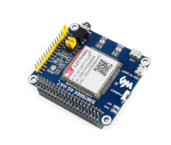
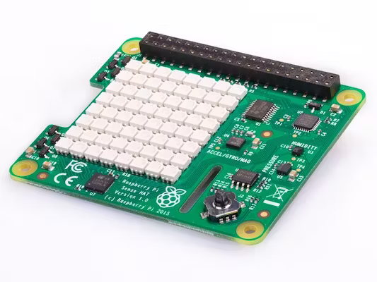
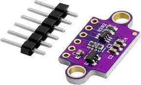

Systèmes Embarqués
==================

Nemesis est un UAV de type avion, motorisé et doté de multiples composants que nous détaillons ci-dessous.

Composants
----------

Chaîne de propulsion et d'alimentation
**************************************

Le choix de ces composants étant dépendant des modèles et prototypes, nous ne le détaillerons pas ici.
L'alimentation se fait par une batterie LiPo 3S 11.1V. Un ESC permet de contrôler le moteur brushless et son BEC
permet d'alimenter le contrôleur de vol en 5V 3A.

Contrôleur de vol
*****************

Nos contrôleurs de vol sont des Raspberry Pi 4B 2Go et 3A+ 1Go équipés de nos :doc:`logiciels <embeded_software>`.

La connectivité 4G et les données de positionnement sont acquises par un `SIM7600G-H HAT <https://www.waveshare.com/wiki/SIM7600E-H_4G_HAT>`_.

   LTE/GNSS Hat

Les mesures d'orientation, d'accélération de température et de pression sont acquises par un `Sense Hat <https://www.raspberrypi.com/products/sense-hat/>`_.

   Sense Hat (9-DOF IMU, temp., humidity, pressure)

Pour les mesures de distance au sol, nous utilisons 2 VL53L0X, des capteurs de distance laser à temps de vol.

   VL53L0X distance sensor

Nemesis est aussi doté d'une liaison radio pour les tests et en cas de perte de la connectivité 4G. Nous utilisons
un combo FS-i10X et FS-iA10B.
S'ajoute à cela des câbles et de cervos pour le contrôle des gouvernes.
