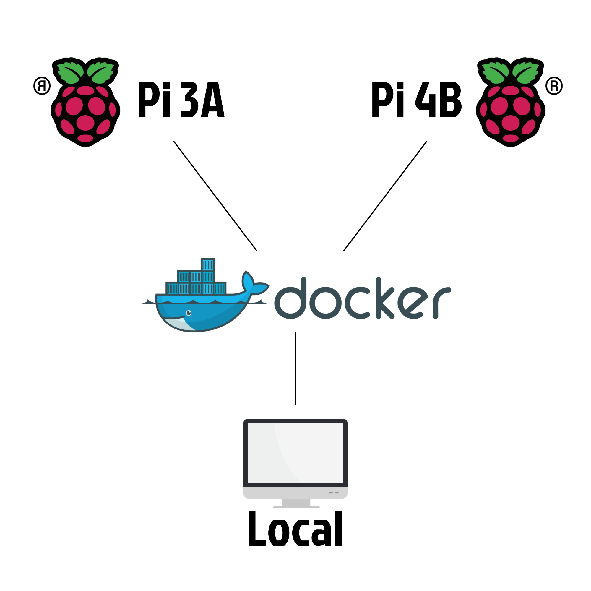

Logiciels Embarqués
=================================

Cette note technique décrit l'architecture utilisée pour implémenter nos différents systèmes dans les contrôleurs
embarqués.

Modularité
----------
La possibilité d'évolution matérielle et les différentes versions de composants nous ont poussé à concevoir nos systèmes
avec pour objectif principal la modularité et la flexibilité. Dans cette optique, nous avons choisi d'utiliser
``Docker`` pour déployer facilement nos solutions sur différents matériels.

L'utilisation de ``Docker`` nous permet également de reproduire en partie notre environnement de production pour une
plus grande facilité de développement.

Composants
----------
Dans l'optique de la modularité nous avons choisi de découper nos systèmes en composants. Chaque composant s'exécute
dans un processus distinct et communique avec les autres via Redis.

La classe ``IPC`` s'occupe de la gestion de la communication inter-processus avec un système de routes.
Chaque composant peut ainsi définir des fonctions à appeler lors de la réception d'un message sur des routes précises
et peut également envoyer des messages sur des routes. Chaque route utilisée est indiquée dans la documentation de la
partie embarquée.

Un manager s'occupe de gérer les composants, en le lui indiquant via l'IPC, il peut démarrer, arrêter ou redémarrer des
composants, cela nous permet d'avoir un contrôle total sur les différents composants logiciels directement depuis l'UI.

Un composant "NVS" (Nemesis Video Streaming) se charge de gérer la transmission de flux vidéo provenant de la caméra vers le serveur.
Celui-ci se reconnecte automatiquement au serveur.
