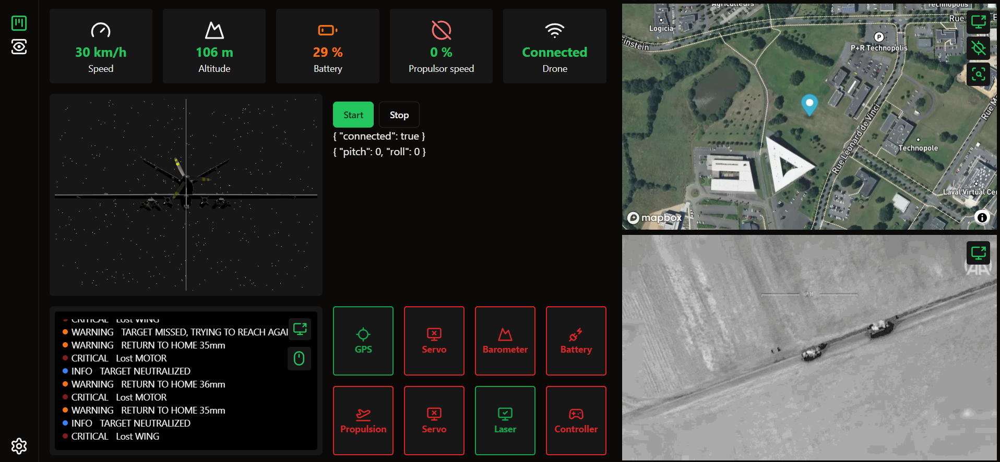

Interface utilisateur
=====================

Cette note technique décrit le fonctionnement de l'interface utilisateur permettant de piloter, visualiser et configurer les différents systèmes du drone.

Objectif
--------

L'objectif premier de l'interface utilisateur est de permettre de piloter, visualiser et configurer le drone à distance et depuis n'importe quel appareil doté d'un navigateur web et une connexion à internet. L'interface se veut, par sa conception, évolutive et modulaire afin de pouvoir ajouter de nouveaux systèmes et fonctionnalités liés au drone.

Choix des technologies
-----------------------

Le choix des technologies utilisées pour le développement de l'interface utilisateur s'est porté sur :

- `Vue.js 3 <https://vuejs.org/>`_: Framework JavaScript populaire, bien documenté et simple à prendre en main. Permettant à n'importe qui de contribuer au développement de l'interface.
- `Nuxt.js 3 <https://nuxt.com/>`_: Framework basé sur Vue.js, permettant de développer une grosse application de façon intuitive et surtout maintenable dans le temps.
- `TypeScript <https://www.typescriptlang.org/>`_: Langage de programmation typé permettant de développer des applications plus robustes et maintenables dans le temps.

Nous avons également choisi d'utiliser :

- `Tailwind CSS <https://tailwindcss.com/>`_: Framework CSS permettant de développer le style d'une application de façon simple et rapide sous forme de composants.
- `ShadeCN <https://www.shadcn-vue.com/>`_: Librairie de composants pour le développement de composants plus complexes.

Fonctionnalités
---------------
Authentification
^^^^^^^^^^^^^^^^
Pour assurer la sécurité de l'interface, nous avons mis en place un système d'authentification basé sur `JWT <https://jwt.io/>`_.
Un token est généré par le serveur lors de la connexion et est valide pendant 60 minutes. Ce token assure l'identification de l'utilisateur.

Affichage des données captées et renvoyées par le drone
^^^^^^^^^^^^^^^^^^^^^^^^^^^^^^^^^^^^^^^^^^^^^^^^^^^^^^^
L'interface permet d'afficher les données captées par le drone en temps réel. 
Comme par exemple la position GPS affichée sur une carte, le flux vidéo, la position relative du drone retranscrite sur un modèle 3d...

Ou encore des données brutes comme l'altitude, la vitesse, la vitesse moteur, la tension de la batterie, l'état de connexion du drone, les logs...

L'objectif est de pouvoir afficher les données captées par le drone pouvant servir d'aide au pilotage à distance.

Pilotage manuel et gestion des composants
^^^^^^^^^^^^^^^^^^^^^^^^^^^^^^^^^^^^^^^^^

L'interface permet de piloter le drone manuellement à l'aide d'une manette connectée à l'ordinateur.
Le drone reçoit en temps réel les mouvements des joysticks analogiques ou encore la vitesse moteur choisie par l'opérateur.

Il est aussi possible d'éteindre/allumer/rédémarrer chaque composant du drone à distance. 
Dans le cas où un composant dysfonctionne, il est possible de le redémarrer sans avoir à se déplacer jusqu'au drone.

Pilotage automatique et gestion de parcours
^^^^^^^^^^^^^^^^^^^^^^^^^^^^^^^^^^^^^^^^^^^

En attente de développement.

Gestion de la caméra et du flux vidéo
^^^^^^^^^^^^^^^^^^^^^^^^^^^^^^^^^^^^^

Le flux vidéo est récupéré via WebSocket depuis le serveur au sol. Ce flux est ensuite affiché par l'intermédiaire de frames JPEG.
La reconnexion au serveur en cas de perte de contact est automatique.

Paramètres utilisateur et configuration de l'application
^^^^^^^^^^^^^^^^^^^^^^^^^^^^^^^^^^^^^^^^^^^^^^^^^^^^^^^^

En attente de développement.
